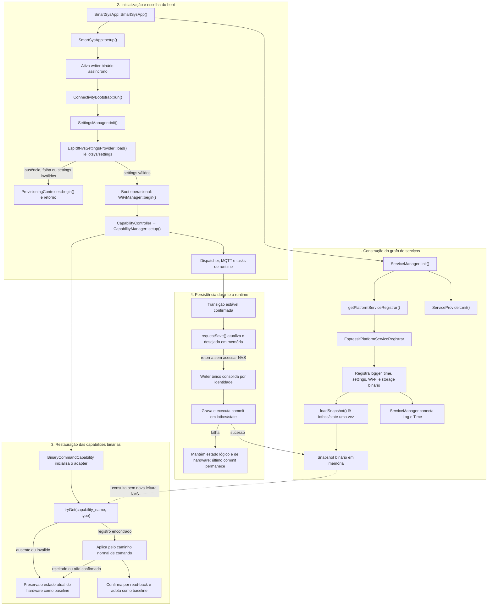

# Árvore do conhecimento — Bootstrap + Registry de NVS

Este mapa cobre somente o caminho que constrói o grafo de serviços, registra
os provedores NVS, escolhe o fluxo de boot e disponibiliza a persistência às
capabilities binárias.

No código atual não existe um componente chamado `NvsRegistry`. O papel de
registry é exercido por `ServiceProvider`: o registrador da plataforma
Espressif deposita nele serviços construídos para o boot, e `ServiceManager`
fornece os pontos de acesso. Dois domínios usam NVS sem compartilhar namespace
ou modelo de dados: settings e estados binários de capabilities.

## Mapa do fluxo

## Dois domínios NVS no mesmo bootstrap

| Domínio | Registro no grafo | Namespace/chave | Uso no boot | Consumidor principal |
|---|---|---|---|---|
| Settings | `setSettings`, `setSettingsGate` e `setSettingsManager` | `iotsys/settings` | `ConnectivityBootstrap` carrega o blob e decide entre Wi-Fi e provisioning | bootstrap, conectividade e serviços de runtime |
| Estado binário | `setBinaryCapabilityStateProvider` | `iotbcs/state` | o registrador carrega um snapshot; `SmartSysApp::setup()` ativa o writer | capabilities derivadas de `BinaryCommandCapability` |

## Pontos de entrada para investigação

| Se a mudança envolve... | Comece por... | Continue em... |
|---|---|---|
| ordem de construção e inicialização | `src/Core/Providers/ServiceManager.cpp` | `src/Platform/Espressif/Providers/EspressifPlatformServiceRegistrar.cpp` e `src/SmartSysApp.cpp` |
| serviços registrados e seus accessors | `src/Contracts/Providers/ServiceProvider.h` | `src/Core/Providers/ServiceProvider.cpp` e `src/Core/Providers/ServiceManager.h` |
| decisão Wi-Fi ou provisioning | `src/App/Managers/ConnectivityBootstrap.cpp` | `src/Core/Settings/SettingsManager.cpp` |
| formato e compatibilidade dos settings persistidos | `src/Platform/Espressif/Settings/Providers/EspIdfNvsSettingsProvider.h` | implementação `.cpp` correspondente |
| contrato de persistência binária | `src/Contracts/Providers/IBinaryCapabilityStateProvider.h` | `src/Platform/Espressif/Capabilities/Providers/EspNvsBinaryCapabilityStateProvider.*` |
| restauração e solicitação de persistência pelas capabilities | `src/Core/Capabilities/CapabilityHelpers.h` | `src/Core/Capabilities/CapabilityManager.cpp` |
| comportamento normativo e critérios de aceite | `docs/specs/CORE-RUNTIME-LIFECYCLE.md` | `docs/specs/BINARY-COMMAND-STATE-PERSISTENCE.md` |
| evidência executável existente | `test/test_service_graph_identity/` | `test/test_binary_capability_state_storage/` e `test/test_binary_command_capability_state/` |

## Invariantes que orientam mudanças

- O grafo é construído uma vez; `ServiceManager::init()` e `instance()` devem
  convergir para a mesma instância.
- O registrador de plataforma preenche `ServiceProvider` antes que o restante
  de `SmartSysApp` consuma logger, settings ou storage binário.
- Settings e estados binários têm namespaces, formatos e políticas de falha
  próprios. Alterar um não deve pressupor que o outro se comporta igual.
- O snapshot binário é lido no bootstrap antes da existência das capabilities;
  `tryGet()` e `handle()` não fazem leituras NVS.
- O writer binário é ativado antes de `CapabilityManager::setup()` e nenhuma
  solicitação de persistência executa ou aguarda write/commit.
- Uma capability restaura estado apenas depois de inicializar o hardware e só
  aceita o valor restaurado quando a aplicação e o read-back o confirmam.
- A identidade do registro binário é o par `(capability_name, type)` e o limite
  do runtime permanece em oito capabilities.
- Falha do storage binário degrada somente a persistência binária: não deve
  apagar a NVS global, abortar ou reverter o estado já confirmado no hardware.
- O provider de settings possui uma recuperação própria que pode reinicializar
  a partição NVS quando encontra `NO_FREE_PAGES` ou `NEW_VERSION_FOUND`; essa
  diferença é relevante antes de alterar a política de inicialização global.

## Ramos de falha que merecem critérios de aceite

- registrador de plataforma ausente ou serviço obrigatório não registrado;
- falha ao inicializar, abrir ou ler NVS de settings;
- settings ausentes, incompatíveis ou sem configuração operacional válida;
- falha ao inicializar, abrir, ler ou validar o snapshot binário;
- falha ao criar o mutex ou a task do writer;
- identidade inválida ou capacidade do snapshot esgotada;
- falha de write ou commit sem rollback do estado lógico e de hardware;
- registro restaurado rejeitado pelo adapter ou divergente no read-back.
