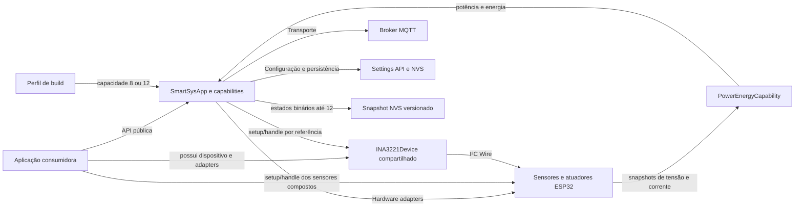

# EKOM — Mapa da Fonte Única da Verdade do IoTSmartSysCore

**Classe da fonte:** Normativa

**Estado da fonte:** Vigente

**Última atualização:** 03/09/2026 (capacidade configurável do runtime 0.1)

## 1. Governança

| Área | Fonte | Tipo | Estado |
|---|---|---|---|
| Instruções e roteamento para agentes | `AGENTS.md` | Normativo | Active — EKOM 4.6 |
| Adaptador para Claude Code | `CLAUDE.md` | Operacional | Active |
| Diretrizes locais EKOM | `docs/rfc/EKOM-GUIDELINES.md` | Normativo | Active — EKOM 4.6 |
| Diretrizes EKM legadas | `docs/rfc/EKM-GUIDELINES.md` | Histórico | Superseded |
| Decisões arquiteturais locais | `docs/adr/` | Normativo | Active |
| Mapa de conhecimento | `docs/rfc/KNOWLEDGE-MAP.md` | Normativo | Active |
| Histórico e transações EKOM | `docs/rfc/EKOM-CHANGELOG.md` | Operacional | Active |
| Histórico e transações EKM | `docs/rfc/EKM-CHANGELOG.md` | Histórico | Closed |
| Relatórios de execução dos papéis | `docs/reports/` | Operacional | Active — destino criado em `EKM-CHG-0036`; relatórios são imutáveis e cada execução cria arquivo novo |
| Experimento EKOM da persistência binária | `docs/rfc/EKOM-EXPERIMENT-BINARY-COMMAND-STATE-PERSISTENCE.md` | Experimental | Pending Architect Confirmation |

## 2. Índice de domínios e autoridade

| Domínio | Fonte | Estado normativo | Implementação |
|---|---|---|---|
| Governança EKOM 4.6 | `docs/rfc/EKOM-GUIDELINES.md` | Active | Vigente desde `EKOM-CHG-0001` |
| API pública e compatibilidade | `docs/specs/PUBLIC-API-COMPATIBILITY.md` | Active | Implemented |
| Ciclo de vida do runtime | `docs/specs/CORE-RUNTIME-LIFECYCLE.md` | Active | Implemented |
| Capacidade configurável do runtime | `docs/specs/RUNTIME-CAPABILITY-CAPACITY.md` | Draft 0.1 — análise pendente | Not Started |
| Release e distribuição | `docs/specs/RELEASE-AND-DISTRIBUTION.md` | Active | In Progress |
| Exemplos executáveis e hardware | `docs/specs/EXECUTABLE-HARDWARE-EXAMPLES.md` | Active | Implemented |
| Estado do controle de garagem | `docs/specs/GARAGE-CONTROL-STATE.md` | Active | Validated |
| Console de tela como ferramenta | `docs/specs/SCREEN-CONSOLE-TOOLING.md` | Active 0.3 — revisão de implementabilidade `Implementable` | Validated; `Done` após validação física, decisão explícita do Arquiteto e integração à `main` (`EKM-CHG-0042`) |
| Leitura de corrente contínua fotovoltaica | `docs/specs/CURRENT-SENSING-CAPABILITY.md` | Active 0.6 — Ready | Validated; `Done` após integração à `main` (`EKM-CHG-0052`) |
| Medição de tensão por Hardware Adapter | `docs/specs/VOLTAGE-SENSING-CAPABILITY.md` | Active 0.1 — Ready | Validated; `Done` após integração à `main`; `-1000.00` significa leitura ADC abaixo de `VoltageSensorConfig::adcMinimumMv` (`EKOM-CHG-0004`) |
| Sensores de tensão e corrente INA3221 | `docs/specs/INA3221-SENSORS.md` | Active 0.2 — Ready | Validated; `Done` após validação do Arquiteto e integração à `main` (`EKOM-CHG-0021`) |
| Potência e energia por composição de sensores | `docs/specs/POWER-ENERGY-CAPABILITY.md` | Active 0.3 — Ready | Validated; `Done` após validação do Arquiteto e integração à `main` (`EKOM-CHG-0016`) |
| Temperatura por NTC resistivo | `docs/specs/NTC-TEMPERATURE-SENSOR.md` | Active 0.1 — Ready | Validated; `Done` após integração à `main`; leitura inválida retorna `-1000.0f` (`EKOM-CHG-0007`) |
| Atuador binário de ventilador | `docs/specs/FAN-CAPABILITY.md` | Active 0.1 — Ready | Validated; `Done` após revisão, validação em hardware e integração à `main` (`EKOM-CHG-0010`) |
| Persistência de comandos binários | `docs/specs/BINARY-COMMAND-STATE-PERSISTENCE.md` | Active | Validated (versão 0.6) — validação física e aprovação explícita do Arquiteto registradas em `EKM-CHG-0032`; entrega `Ready for Integration`. `BCS-DEC-001` e `BCS-REV-003` permanecem pendentes/`Deferred`; suítes seguem em quarentena; `Done` depende de confirmação futura de integração à `main` |

`docs/REPO_DOSSIER.md` é material informativo legado e não prevalece sobre as fontes acima.

### 2.1 Cobertura de adoção

| Domínio | Cobertura | Entradas principais | Observação |
|---|---|---|---|
| API pública | Specified | `src/SmartSysApp.*`, builders, interfaces, configs | Compatibilidade exige validação dedicada |
| Runtime principal | Specified | `src/main.cpp`, `src/SmartSysApp.cpp` | Arduino sobre ESP32 |
| Capabilities | Specified | builders, adapters e contracts | Controle de garagem ativo; persistência binária 0.6 `Active`/`Validated`/`Ready for Integration` (`EKM-CHG-0032`), com BCS-REV-001/002 encerrados, BCS-REV-003 `Deferred` e suítes em quarentena; leitura fotovoltaica `IOTSSC-CURRENT-SENSOR@0.6` em `Active`/`Ready`/`Validated`/`Done` (`EKM-CHG-0052`); medição de tensão `IOTSSC-VOLTAGE-SENSOR@0.1` em `Active`/`Ready`/`Validated`/`Done` (`EKOM-CHG-0004`); adapters INA3221 de tensão e corrente em `Active 0.2`/`Ready`/`Validated`/`Done` (`EKOM-CHG-0021`); composição de potência e energia `IOTSSC-POWER-ENERGY-CAPABILITY@0.3` em `Active`/`Ready`/`Validated`/`Done` (`EKOM-CHG-0016`); temperatura por NTC `IOTSSC-NTC-TEMPERATURE-SENSOR@0.1` em `Active`/`Ready`/`Validated`/`Done` (`EKOM-CHG-0007`); atuador binário de ventilador `IOTSSC-FAN-CAPABILITY@0.1` em `Active`/`Ready`/`Validated`/`Done` (`EKOM-CHG-0010`) |
| Settings e API HTTP/HTTPS | Mapped | settings, API e storage | Histórico de regressões; falta especificação profunda |
| Wi-Fi e MQTT | Mapped | connectivity e transport | MQTT é transporte principal |
| UART | Inventoried | serial transport | Transporte auxiliar |
| Provisioning e factory reset | Mapped | bootstrap e platform services | Requer especificação própria quando tocado |
| OTA | Inventoried | serviços OTA | Sem especificação própria |
| Plataformas | Mapped | `src/Platform/Arduino`, `src/Platform/Espressif`, legado ESP8266 | ESP-IDF é preparação futura; ESP8266 não é suportado; console de tela ST7789 opt-in e exemplo Ideaspark validados em hardware (`EKM-CHG-0042`) |
| Build e release | Specified | `platformio.ini`, `Makefile`, `.github/workflows/` | Existem desvios abertos |
| Testes | Inventoried | `test/`, `configs/esp32s3-test.ini` | As 18 suítes existentes em 01/08/2026 estão nominalmente em quarentena por `test_ignore` conforme `BCS-DEC-007`; são preservadas, mas não compiladas, carregadas, executadas nem aceitas como evidência até nova decisão de maturidade |
| Exemplos executáveis | Specified | `src/ExecutableExampleRunner.cpp`, `examples/executable/`, `configs/executable_examples.ini` | `screen_console` validado em hardware em `EKM-CHG-0042`; `current_sensor` validado em hardware em `EKM-CHG-0052`; `voltage_sensor` validado em hardware por decisão do Arquiteto em `EKOM-CHG-0004`; `environment_ntc` validado em hardware por decisão do Arquiteto em `EKOM-CHG-0007`; `fan` validado em hardware por decisão do Arquiteto em `EKOM-CHG-0010`; `power_energy` validado e concluído (`EKOM-CHG-0016`); `ina3221_voltage_current` compila com a dependência PlatformIO `^1.0.1` e foi validado em hardware por decisão do Arquiteto (`EKOM-CHG-0021`) |

### 2.2 Fronteira de composição de potência e energia

`PowerEnergyCapability` recebe `IVoltageSensor` e `ICurrentSensor` por
referências não proprietárias e somente consome seus últimos snapshots. Ela não
chama nem verifica `setup()` ou `handle()` desses sensores. A aplicação
consumidora responde pelo lifecycle, pela atualização e pela duração das duas
referências, independentemente de os sensores também serem acionados por
`VoltageSensorCapability` ou `CurrentSensorCapability`. A autoridade deste
contrato é `IOTSSC-POWER-ENERGY-CAPABILITY@0.3`. O exemplo contratado
`power_energy` demonstra o cenário sem capabilities próprias: possui e aciona
diretamente os dois adapters, usa GPIO 34 para corrente e GPIO 33 para tensão e
registra somente a `PowerEnergyCapability` na aplicação. A exclusão de
configuração de sensores se aplica à lógica interna da capability, não à
configuração desses adapters preexistentes pelo exemplo.

### 2.3 Fronteira dos sensores INA3221

`INA3221Device` possui o único driver Adafruit de um dispositivo físico e é
compartilhado por `INA3221VoltageSensor` e `INA3221CurrentSensor`. A aplicação
consumidora possui o dispositivo e os dois adapters; `SmartSysApp` possui
somente as capabilities registradas pelos overloads que recebem
`IVoltageSensor&` e `ICurrentSensor&`. As capabilities conduzem `setup()` e
`handle()` dos adapters, enquanto o setup idempotente impede reinicialização do
mesmo endereço. A autoridade deste contrato é
`IOTSSC-INA3221-SENSORS@0.2`.

## 3. Árvore de conhecimento

```text
IoTSmartSysCore
├── Governança EKOM
│   ├── roteamento e diretrizes locais
│   ├── especificações e decisões
│   └── relatórios, transações, lacunas e débitos
├── Runtime Arduino/ESP32
│   ├── SmartSysApp e lifecycle cooperativo
│   ├── capacidade estática configurável por environment
│   ├── capabilities, builders e hardware adapters
│   ├── dispositivo INA3221 compartilhado e adapters externos de tensão/corrente
│   ├── composição de potência/energia com lifecycle externo dos sensores
│   └── settings, conectividade, provisioning e OTA
├── Interfaces e integrações
│   ├── API pública da biblioteca
│   ├── MQTT, HTTP/HTTPS e UART
│   └── persistência NVS
└── Evidências e distribuição
    ├── exemplos executáveis e validação física
    ├── testes PlatformIO/Unity
    └── build e release
```

## 4. Diagrama de relações



## 5. Lacunas

### EKM-GAP-0001 — Evidência de compatibilidade pública

**Estado:** Open

Criar matriz de compatibilidade e validação representativa para `SmartSysApp`, `SensorFactory`, interfaces e configs.

### EKM-GAP-0002 — Release divergente

**Estado:** Open

O release não impede execução fora de `main` e há divergência entre os caminhos do header de versão usados pelo `Makefile` e pelo workflow.

### EKM-GAP-0003 — Domínios críticos ainda não especificados

**Estado:** Open

Settings, API HTTP/HTTPS, Wi-Fi e MQTT possuem histórico de regressão e precisam de especificações incrementais antes de mudanças relevantes.

### EKM-GAP-0004 — Fronteiras de plataforma

**Estado:** Open

Classificar formalmente o código preparatório para ESP-IDF e o código legado ESP8266 antes de remoções ou expansão de suporte.

### EKM-GAP-0005 — Dossiê histórico

**Estado:** Open

Revisar `docs/REPO_DOSSIER.md`, corrigir referências obsoletas e decidir se partes devem migrar para especificações.

### EKM-GAP-0006 — Catálogo inicial de exemplos

**Estado:** Closed

Foram definidos `iotsmartsys_mcb_r1`, os exemplos `basic_light` e `environment_dht`, o uso privado da infraestrutura real e a compilação dos dois environments em CI. A especificação foi promovida para `Active`.

### EKM-GAP-0007 — Conformidade dos exemplos com o pinout MCB R1

**Estado:** Closed

Uma nova revisão integral válida declarou a especificação `Implementable` antes da correção. `basic_light` e `environment_dht` passaram a consumir diretamente `ITS_MCB01_RELAY_PIN` e `ITS_MCB01_TEMPERATURE_SENSOR_PIN`; macros locais e GPIOs literais foram removidos dos environments. Builds e verificações estáticas aprovaram a conformidade de pinout. A validação física geral da especificação permanece pendente em `EKM-CHG-0002`, mas não constitui lacuna do contrato de pinout.

### EKM-GAP-0008 — EKM Gate e garantias automatizadas

**Estado:** Superseded

O modelo 1.9 não incorpora `EKM Gate`, orquestração ou garantias automatizadas ao
fluxo vigente. Qualquer adoção futura dependerá de nova decisão do Arquiteto e
de evidência proporcional ao problema; nenhuma garantia automática está
implantada atualmente.

### EKM-GAP-0009 — Validação da máquina de estados da garagem

**Estado:** Closed

A máquina de estados conforme `IOTSSC-GARAGE-CONTROL` foi implementada e
validada em ambiente de hardware conforme declaração do Arquiteto. A limitação
preexistente do environment automatizado permanece registrada em
`EKM-CHG-0007`, mas não mantém aberta a lacuna de validação física.

### EKM-GAP-0010 — Limite público da identidade de capability

**Estado:** Closed

O Arquiteto confirmou em `BCS-DEC-005` os limites públicos de 63 bytes para o
`capability_name` definitivo e 31 bytes para `type`, excluídos os terminadores,
com rejeição observável antes do registro e sem efeito parcial. A versão 0.6
incorpora limites, compatibilidade, adequação de consumidores excedentes e
critérios assertáveis; a lacuna está encerrada.

### EKM-GAP-0011 — Mutabilidade da identidade após registro

**Estado:** Closed

O Arquiteto completou `BCS-DEC-006` em `EKM-CHG-0025`: `capability_name` e
`type` passam a ser imutáveis e somente legíveis depois de finalizados antes do
registro. `rename()` e `applyRenamedName()` permanecem públicos, obsoletos e
com retorno `void`, mas não alteram a identidade registrada. Os ponteiros
devolvidos por `SmartSysApp::add*Capability()` permanecem como estão. BCS-002,
BCS-022, BCS-AC-002 e BCS-AC-021 incorporam a decisão, encerrando a lacuna.

### EKM-GAP-0012 — Contrato incompleto da medição de corrente 0.2

**Estado:** Closed — decisões incorporadas na versão 0.3

`IOTSSC-CURRENT-SENSOR@0.2` dependia da definição de
`maximumZeroDeviationMv`, `adcMaximumMv` e `sampleIntervalUs` por perfil/target,
da representação das estimativas abaixo de `0,50 A`, do alcance da rejeição de
conflitos de GPIO e da representação textual do envelope de medição. As seis
lacunas foram registradas como `CUR-GAP-001` a `CUR-GAP-006` e confirmadas pelo
relatório de implementabilidade 0.2. `IOTSSC-CURRENT-SENSOR@0.3` incorpora os
limites do ESP32 clássico, os estados `NOT_READY` e `ESTIMATED`, o alcance local
dos conflitos e o JSON textual normalizado. O encerramento da lacuna não
antecipa o resultado da nova análise formal da versão 0.3.

### EKM-GAP-0013 — Estados incompletos da medição de corrente 0.3

**Estado:** Closed — decisões incorporadas na versão 0.4

O relatório de implementabilidade 0.3 identificou ausência de `supplyStatus`
antes da primeira amostra do monitor e ausência de estado e política após
calibração de zero inválida. `IOTSSC-CURRENT-SENSOR@0.4` incorpora `UNKNOWN`,
`CALIBRATING` e `ZERO_CALIBRATION_FAILED`, impede uso do zero anterior depois
da falha e mantém o valor escalar vazio nesses estados. A versão também revoga
o JSON dentro de `ICapability::value` e move os estados para campos opcionais do
evento. O encerramento não antecipa o resultado da nova análise formal.

## 6. Débitos técnicos

Nenhum débito técnico está registrado sob a guarda do EKOM 4.6. Referências
históricas a “dívida futura” não constituem aceitação de débito sem decisão
explícita do Arquiteto, identidade `EKOM-DEBT-NNNN` e critério de quitação.

## 7. Manutenção

**Namespace vigente:** `EKOM` para novas transações, lacunas e débitos;
`EKM` é preservado para identificadores legados.

Atualize índice, árvore e diagrama quando autoridade, contenção,
responsabilidade ou relação material mudar. Somente o Arquiteto determina
conclusão ou reabertura e aceita ou quita débito técnico.

### 7.1 Baseline inicial

- Branch: `main`.
- Commit: `0c6d5e63eb09d826beba2e16a3085c1a8f814668`.
- Worktree inicial da adoção: limpo.
- Runtime suportado: Arduino sobre ESP32.
- ESP8266: não suportado.
- Release: tags na branch `main`, com publicação pelo GitHub Actions no PlatformIO.

### 7.2 Evolução da governança

- `EKOM-CHG-0001`: adota o EKOM 4.6 para novas atuações, preserva o histórico
  EKM 1.x sem reinterpretação retroativa e institui os ativos `EKOM-*` vigentes.
- `EKOM-CHG-0002`: registra `IOTSSC-VOLTAGE-SENSOR@0.1` com divisor dinâmico,
  sentinel abaixo do mínimo, adapter separado e exemplo contratado.
- `EKOM-CHG-0003`: implementa a versão 0.1, incluindo API, adapter cooperativo,
  arbitragem bilateral com corrente, exemplo MCB R1 e builds aprovados; revisão
  e validações instrumentadas/físicas permanecem pendentes.
- `EKOM-CHG-0004`: registra revisão de código e validação em hardware pelo
  Arquiteto, promove a versão 0.1 para `Active`/`Validated`, integra o recorte à
  `main` e conclui a entrega como `Done`.
- `EKOM-CHG-0005`: registra `IOTSSC-NTC-TEMPERATURE-SENSOR@0.1` com adapter
  parametrizável, perfis 100 kΩ e MF52-103 10 kΩ, equação Beta, média
  fracionária de 16 amostras, sentinel `-1000.0f` e exemplo contratado.
- `EKOM-CHG-0006`: implementa a versão 0.1, incluindo adapter, factory,
  diagnóstico, exemplo MCB R1 e builds aprovados.
- `EKOM-CHG-0007`: registra validação do código em hardware pelo Arquiteto,
  promove a versão 0.1 para `Active`/`Validated`, integra o recorte à `main` e
  conclui a entrega como `Done`.
- `EKOM-CHG-0008`: registra `IOTSSC-FAN-CAPABILITY@0.1` com comportamento
  binário equivalente a `SwitchCapability`, type `Fan Actuator`, `FanConfig`
  própria, persistência herdada e exemplo executável, sem artefatos de teste.
- `EKOM-CHG-0009`: implementa `FanCapability`, configuração, API pública e
  exemplo MCB R1; preserva como reprovado o build canônico afetado por erros
  preexistentes fora do recorte.
- `EKOM-CHG-0010`: registra revisão e validação em hardware pelo Arquiteto,
  promove a versão 0.1 para `Active`/`Validated`, integra o recorte à `main` e
  conclui a entrega como `Done`.
- `EKOM-CHG-0011`: registra `IOTSSC-POWER-ENERGY-CAPABILITY@0.1` com potência
  por magnitude, energia volátil por integração temporal e lifecycle externo
  dos sensores, sem artefatos de teste; permanece `Draft`/`Pending Review` e
  `Not Started`.
- `EKOM-CHG-0012`: implementa a composição, API, registro e publicação
  aditiva de potência e energia; o build `esp32_dev` é aprovado, a implementação
  passa a `Implemented` e nenhum teste é criado, alterado ou executado.
- `EKOM-CHG-0013`: corrige a especificação para 0.2 ao contratar o exemplo
  executável `power_energy`, com lifecycle externo explícito, corrente no GPIO
  34, tensão no GPIO 33 e reset local; a nova versão aguarda análise formal.
- `EKOM-CHG-0014`: corrige a especificação para 0.3 ao delimitar à lógica
  interna da capability a exclusão de configuração dos sensores, incorporando
  o bloqueador formal da versão 0.2 e encaminhando a nova versão para análise.
- `EKOM-CHG-0015`: implementa o exemplo `power_energy` com adapters externos,
  lifecycle explícito, GPIOs oficiais 34/33 e reset local; o build próprio é
  aprovado, mas o gate canônico preexistente mantém a versão `In Progress`.
- `EKOM-CHG-0016`: registra a validação declarada pelo Arquiteto, promove a
  versão 0.3 para `Active`/`Validated`, integra o recorte à `main` e conclui a
  entrega como `Done`.
- `EKOM-CHG-0017`: registra `IOTSSC-INA3221-SENSORS@0.1` com dispositivo I²C
  compartilhado, adapters de tensão e corrente, overloads públicos sob
  ownership externo e exemplo combinado MCB R1 com endereço `0x40`, canal 0 e
  shunt R100; permanece `Draft`/`Pending Review`/`Not Started`.
- `EKOM-CHG-0018`: implementa o recorte INA3221 e confirma sua compilação com
  a tag Git 1.0.3; a ausência dessa versão no registro PlatformIO mantém a
  implementação e o build canônico do exemplo `In Progress`.
- `EKOM-CHG-0019`: corrige a dependência normativa para o pacote PlatformIO
  `adafruit/Adafruit INA3221 Library@^1.0.1`, sem alterar o comportamento dos
  sensores; a versão 0.2 segue para análise.
- `EKOM-CHG-0020`: aplica `^1.0.1` aos dois manifestos, aprova os builds do
  exemplo INA3221 e de `esp32_dev` e encaminha a implementação 0.2 concluída
  para revisão, sem executar testes ou operações de hardware.
- `EKOM-CHG-0021`: registra revisão aderente e validação em hardware declarada
  pelo Arquiteto, promove a versão 0.2 para `Active`/`Validated`, integra o
  recorte à `main` e conclui a entrega como `Done`.

- `EKM-CHG-0003`: introduziu Technical Readiness Review binária e atomicidade da especificação antes da implementação.
- `EKM-CHG-0004`: introduziu imutabilidade normativa em produção, estado de entrega e previsão do futuro `EKM Gate`.
- `EKM-CHG-0005`: tornou a Technical Readiness Review cumulativa, exigiu matriz completa, separou revisão e implementação em execuções distintas e reservou ao arquiteto a autorização para implementar.
- `EKM-CHG-0006`: adotou o modelo EKM 1.9, removeu controles universais sem
  evidência de ganho e transferiu a linhagem técnica documental para o Git.
- `EKM-CHG-0008`: adotou o modelo EKM 1.17, o fluxo sequencial por atores,
  preservação arquitetural explícita, gate de encerramento das execuções,
  Consultor de Arquitetura subordinado e adaptador `CLAUDE.md`.
- `EKM-CHG-0009`: especifica persistência NVS e restauração no boot para
  capabilities derivadas de `BinaryCommandCapability`; a revisão técnica
  declarou o recorte `Implementable`.
- `EKM-CHG-0011`: adota a EKM 1.18 e exige critérios de aceite assertáveis,
  sem confundir compilação com execução.
- `EKM-CHG-0012`: adota a EKM 1.19 e torna operacional no papel do Autor a
  elaboração rastreável, falsificável e independente dos critérios de aceite.
- `EKM-CHG-0013`: corrige a especificação de persistência binária como versão
  0.2, com critérios assertáveis, e a devolve para análise independente.
- `EKM-CHG-0014`: revisão independente de implementabilidade da versão 0.2,
  declarada `Implementable` sem decisão normativa ausente além de
  `BCS-DEC-001` (não bloqueante).
- `EKM-CHG-0015`: implementação parcial da versão 0.2 preservada como
  `In Progress`, sem satisfazer o gate de testes.
- `EKM-CHG-0016`: validação consultiva confronta os 22 critérios e encontra 1
  aprovado, 7 reprovados e 14 não verificados.
- `EKM-CHG-0017`: revisão de implementabilidade da versão 0.3, historicamente
  `Implementable` e depois contestada por `EKM-CHG-0018`.
- `EKM-CHG-0018`: avaliação consultiva registra riscos de hardware e
  inconsistências da revisão 0.3; solicita correções de autoria.
- `EKM-CHG-0019`: autoria da versão 0.4 da persistência binária, incorporando
  `EKM-CHG-0018`; revisão de implementabilidade reinstaurada como
  `Pending Review`.
- `EKM-CHG-0020`: decisões arquiteturais promovem documentalmente a
  persistência binária para a versão 0.5, encerram os bloqueios de `blink`, gate
  e contexto NVS e preservam a revisão como `Pending Review`.
- `EKM-CHG-0021`: revisão integral da versão 0.5 resulta em `Needs
  Clarification`; `EKM-GAP-0010` registra a decisão ausente sobre o limite
  público de `capability_name`, e o baseline `esp32_dev` falho permanece
  dependência separada conforme `BCS-DEC-003`.
- `EKM-CHG-0022`: autoria da versão 0.6 incorpora `BCS-DEC-005`, publica
  limites de identidade de 63/31 bytes com rejeição observável pré-registro,
  encerra `EKM-GAP-0010` e restaura a revisão como `Pending Review`.
- `EKM-CHG-0023`: revisão integral da versão 0.6 resulta em `Needs
  Clarification`; `EKM-GAP-0011` registra a decisão ausente sobre mutação da
  identidade pública depois do registro.
- `EKM-CHG-0024`: decisão parcial do Arquiteto marca `rename()` e
`applyRenamedName()` como obsoletos, sem encerrar `EKM-GAP-0011` nem promover
  a revisão da versão 0.6.
- `EKM-CHG-0025`: o Arquiteto completa `BCS-DEC-006`; a análise integral fecha
`EKM-GAP-0011` e promove a revisão da versão 0.6 para `Implementable`,
  preservando implementação `Not Started`.
- `EKM-CHG-0026`: implementação integral da versão 0.6 em código e testes; a
  implementação permanece `In Progress` porque nenhum critério comportamental
  foi executado (sem alvo ESP32-S3), BCS-AC-022 continua reprovado pelo baseline
  `esp32_dev` e quatro suítes preexistentes não compilam, impedindo estado
  terminal aprovado de `pio test -e esp32s3_test`.
- `EKM-CHG-0027`: revisão técnica independente não aprova a promoção da versão
  0.6; registra três achados materiais em classificação de falhas NVS,
  substituição de `blink` e oráculos de BCS-AC-028. O gate canônico de testes
  terminou com 18 suítes em erro e nenhum caso executado, ampliando a limitação
  factual da evidência anterior.
- `EKM-CHG-0028`: decisão do Arquiteto coloca nominalmente em quarentena todas
  as 18 suítes existentes, inclusive as criadas na implementação 0.6. O
  PlatformIO passa a marcá-las `SKIPPED`; testes deixam de integrar o gate e os
  critérios dependentes ficam `Deferred` até futura decisão de maturidade.
- `EKM-CHG-0029`: nova revisão integral sob `BCS-DEC-007` não executa testes e
  confirma que BCS-REV-001/002 permanecem sem correção no código de produção;
  o build canônico continua reprovado e a implementação não é promovida.
- `EKM-CHG-0030`: o Implementador corrige BCS-REV-001/002, entrega
  separadamente o ajuste versionado do environment `esp32_dev` conforme
  `BCS-DEC-003` e obtém build canônico `SUCCESS`; testes permanecem em
  quarentena e uma nova revisão estática independente é solicitada.
- `EKM-CHG-0031`: revisão técnica independente confirma estaticamente o
  encerramento de BCS-REV-001/002, reexecuta `pio run -e esp32_dev` em rebuild
  limpo (`SUCCESS`) e `git diff --check` (aprovado), confronta o gate da seção
  8.4 sem usar suítes em quarentena como evidência e promove a implementação da
  versão 0.6 para `Implemented`. BCS-REV-003 permanece `Deferred` por
  `BCS-DEC-007`. Validação física (seção 8.5) e aprovação de integração
  continuam pendentes de decisão do Arquiteto.
- `EKM-CHG-0032`: registra a validação física e a aprovação explícita do
  Arquiteto, promove a persistência binária 0.6 para
  `Active`/`Validated`/`Ready for Integration` e fecha `EKM-CHG-0026` por
  objetivo cumprido. `Done` permanece condicionado à confirmação de integração
  à `main`; BCS-REV-003 e as suítes em quarentena continuam como dívida futura.
- `EKM-CHG-0033`: retrospectiva do experimento multiagente e classificação de
  adequação dos perfis executores pela métrica experimental EKOM 2.1; registro
  preparado pelo Consultor e pendente de confirmação final do Arquiteto.
- `EKM-CHG-0034`: autoria da especificação `IOTSSC-CURRENT-SENSOR@0.1`, que
  contrata a medição de corrente contínua em Hardware Adapter e Capability como
  extensão aditiva; permanece em `Draft`, com implementação `Not Started` e
  análise de implementabilidade pendente.
- `EKM-CHG-0035`: autoria da especificação `IOTSSC-SCREEN-CONSOLE@0.1`, que
  incorpora um console de tela como ferramenta de diagnóstico no padrão do
  logging, opt-in por build, e aposenta o componente inerte
  `Display_ST7789_170_320`; permanece em `Draft`, com implementação
  `Not Started` e análise de implementabilidade pendente.
- `EKM-CHG-0036`: análise de implementabilidade de `IOTSSC-SCREEN-CONSOLE@0.1`
  classificada como Pronta [`Ready`], sem bloqueador; a revisão passa a
  `Implementable` e cinco restrições não bloqueantes ficam registradas no
  relatório
  `docs/reports/2026-08-26T012514Z-0.1-5cc6e5eb-implementability-analysis.md`.
  A implementação continua dependente de ordem explícita do Arquiteto.
- `EKM-CHG-0037`: implementação de `IOTSSC-SCREEN-CONSOLE@0.1`; código do
  recorte e build canônico com a flag 0 concluídos, sem símbolos ST7789 no ELF.
  A implementação permanece `In Progress` porque as validações físicas e a
  execução instrumentada autorizável permanecem `Not Executed`.
- `EKM-CHG-0038`: autoria de `IOTSSC-SCREEN-CONSOLE@0.2`; acrescenta o exemplo
  executável `screen_console`, selecionado pelo runner e pelo environment
  `example_screen_console_esp32_dev`, com pinagem Ideaspark e demonstração de
  `ScreenMirrorLogger`. A versão corrente retorna a `Pending Review`.
- `EKM-CHG-0039`: análise integral de `IOTSSC-SCREEN-CONSOLE@0.2` classificada
  como Pronta [`Ready`], sem bloqueador; a revisão passa a `Implementable` e a
  implementação permanece `In Progress`.
- `EKM-CHG-0040`: exemplo executável `screen_console`, seleção pelo runner e
  environment dedicado implementados; builds canônico e habilitado aprovados,
  com validação física fora do recorte autorizado.
- `EKM-CHG-0041`: autoria, análise `Ready` e implementação de
  `IOTSSC-SCREEN-CONSOLE@0.3`; o bloco de linhas do console passa a ser
  ancorado no topo da área útil, com validação física ainda pendente.
- `EKM-CHG-0042`: registra a validação física e a decisão explícita do
  Arquiteto, a confrontação consultiva final e a promoção de
  `IOTSSC-SCREEN-CONSOLE@0.3` para `Active`/`Validated`; a integração à `main`
  conclui a entrega como `Done`.
- `EKM-CHG-0043`: autoria da versão 0.2 de
  `IOTSSC-CURRENT-SENSOR`, que incorpora os perfis elétricos de 5 V e 3,3 V,
  `CUR-DC-004`, o envelope de estados e a API com ownership da aplicação;
  permaneceu em `Draft` e foi classificada como `Not Ready — Specification
  Defect` pelo relatório de implementabilidade 0.2.
- `EKM-CHG-0044`: autoria da versão 0.3 de
  `IOTSSC-CURRENT-SENSOR`, que incorpora as decisões do Arquiteto sobre limites
  do ESP32 clássico, aquisição cooperativa, estimativas, conflitos locais de
  GPIO e JSON textual, encerra `EKM-GAP-0012` e foi classificada como `Not Ready
  — Specification Defect` pelo relatório de implementabilidade 0.3.
- `EKM-CHG-0045`: autoria da versão 0.4 de
  `IOTSSC-CURRENT-SENSOR`, que preserva `value` escalar, adiciona estados
  opcionais ao evento de mudança, resolve as bordas de calibração e alimentação,
  encerra `EKM-GAP-0013` e mantém `Pending Review`.
- `EKM-CHG-0046`: implementação integral de `IOTSSC-CURRENT-SENSOR@0.4` após
  análise `Ready`, com adapter cooperativo ACS712-30A, perfis 5 V/3,3 V,
  capability e evento aditivo, registro público atômico e build canônico
  aprovado; validações físicas e instrumentadas permanecem `Not Executed` e o
  resultado segue para revisão técnica.
- `EKM-CHG-0047`: autoria da versão 0.5 de `IOTSSC-CURRENT-SENSOR`, que corrige
  a omissão do exemplo executável na versão 0.4, acrescenta `CUR-046` a
  `CUR-054`, `CUR-AC-015` a `CUR-AC-017` e a relação normativa com
  `IOTSSC-HW-EXAMPLES`, sem alterar comportamento ou contrato já implementado;
  classificada como `Ready`.
- `EKM-CHG-0048`: implementação do exemplo executável `current_sensor` na MCB R1
  com o símbolo oficial `ITS_MCB01_J4_EXT_ADC`, perfil de 3,3 V no environment
  versionado, seletor exclusivo no runner e catálogo atualizado; builds do
  exemplo, do padrão e do catálogo preexistente aprovados, com validação física
  `Not Executed`.
- `EKM-CHG-0049`: autoria da versão 0.6 de `IOTSSC-CURRENT-SENSOR`, que torna
  `capabilityEvaluationIntervalMs` configuração pública estritamente positiva,
  mantém o timestamp de avaliação privado e preserva o `handle()` cooperativo do
  adapter em todo ciclo; permanece `Draft`/`Not Started`/`Pending Review`.
- `EKM-CHG-0050`: análise integral da versão 0.6 classificada como `Ready`, sem
  bloqueadores; compatibilidade do aggregate e do construtor, transferência pelo
  builder e validação instrumentada permanecem restrições não bloqueantes.
- `EKM-CHG-0051`: implementação da cadência configurável da versão 0.6, com
  default compatível de `1000 ms`, transferência pelo builder, aquisição em todo
  ciclo e avaliação temporal sem dupla publicação inicial; builds do runtime e
  do exemplo aprovados, com validação instrumentada `Not Executed`.
- `EKM-CHG-0052`: confirmação pelo Arquiteto de todas as validações físicas e
  instrumentadas da versão 0.6, confrontação consultiva sem bloqueador e
  promoção para `Active`/`Validated`; integração sincronizada em `main` encerra
  a entrega como `Done`.
